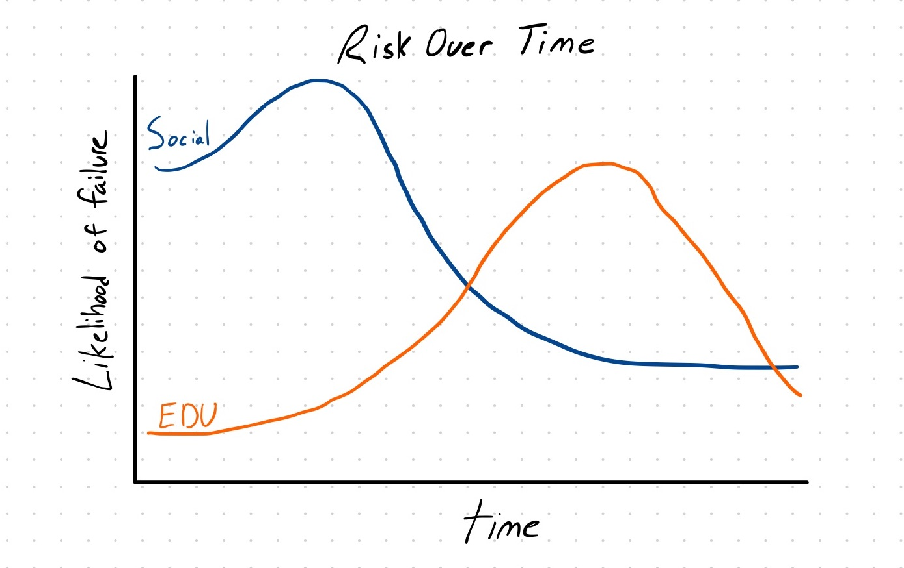

Risk is top of mind for any entrepreneur. It dictates what we build and what we choose not to. While we often fixate on the magnitude of risk, how risk is distributed across time is just as important though less appreciated.

Let me demonstrate via example.
If I were to ask you what is riskier to build a consumer social app or an edtech service matching college student tutors to young students, you'd assert a consumer social app is riskier. From the perspective of building a business, this is true. While starting a tutoring service is rather straightforward, getting user engagement on a social app and preceding to monetize it is extremely difficult. 

What's notable though is when these respective ventures are most likely to fail. 

For a consumer social app, while getting the first users is challenging but often bruteforceable, reaching explosive organic growth is difficult. Once this point is reached, however, and the social network is up and running, inertia often tends to do its magic. 

For the tutoring service, on the other hand, starting out is pretty simple. Scaling a tutoring service, maintaining quality, and warding off competitors, however, is where the real risk lies. Unfortunately, these issues aren't faced till further down the road. 

This graph plots the likelihood of failure for our two startups across time. While the area under the "social" curve is greater than the "edu" curve, the risk for the social curve is frontloaded. 

In the case of the edtech startup, deferring this risk is a dangerous trap. A large time investment is required before risk can be reduced. Entrepreneurs need to fail fast so as to get as many chances at bat. Deferring risk prevents a quick cycle. 

Thus, an entrepreneur needs to define risk as a combination of both magitude and distribution across time lest they waste time and never reach success. ∎
