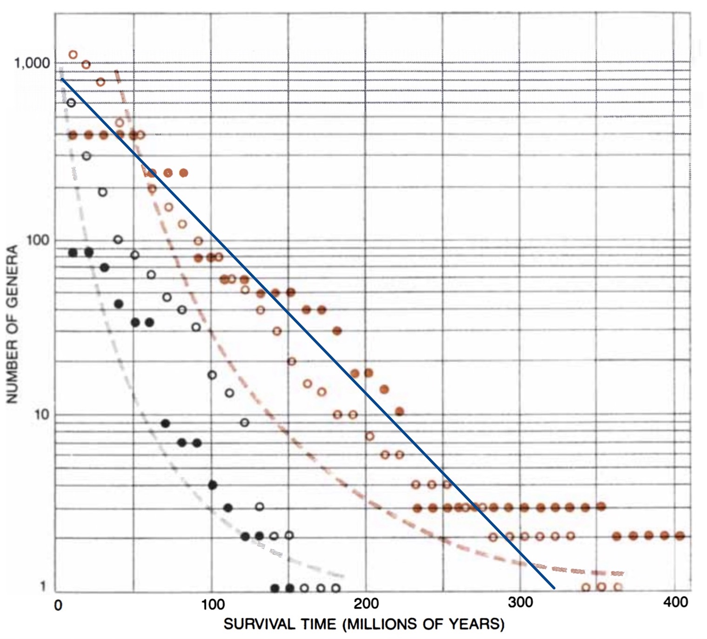
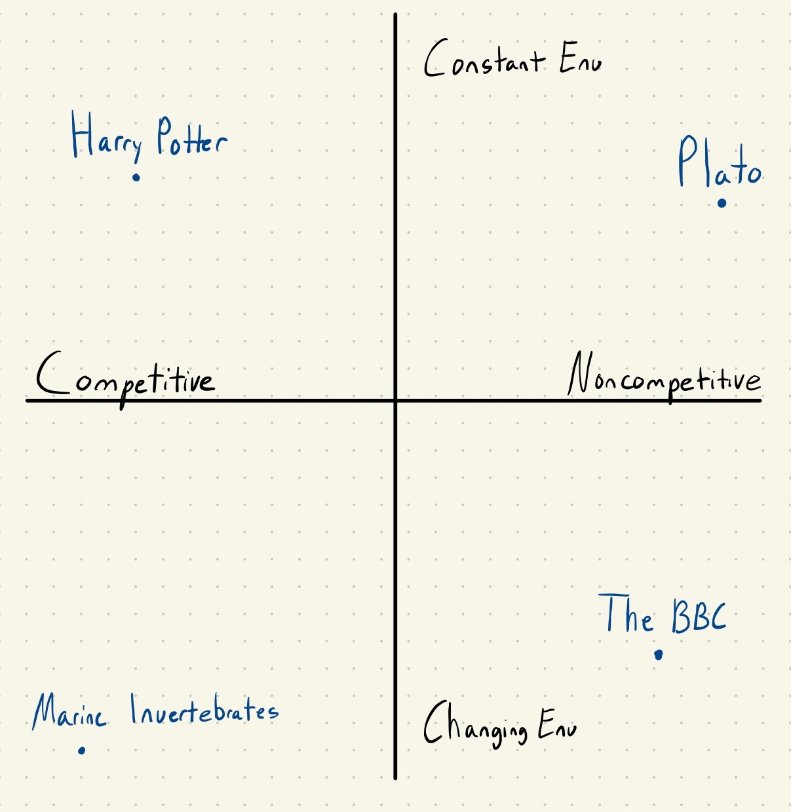

Arising as a joke among New York comedians as a way to predict the success of restaurants, the Lindy effect has increased in prominence over the past decade. The effect theorizes that the expected future lifespan of something is proportional to its current age.  For instance, Plato’s *Republic* would have a longer predicted future lifespan than J.K. Rowling’s *Harry Potter*. This conclusion is intuitive: a book that has been subjected to more selective pressures seems more likely to persist. This heuristic has become the basis for seemingly everything from investment theses and cultural predictions to self-help reading lists. 

 
Let us apply this heuristic more broadly beyond inanimate books and to dynamic systems and evolving organisms. Consider an animal species. Does the length of a species’ existence increase its chance of survival? By the Lindy effect, surely yes. The evidence, however, indicates otherwise. In fact, an older species, despite having undergone many years of natural selection does not have an increased probability of survival and instead merely keeps up with its changing environment [1]. This phenomenon was observed by American evolution biologist Richard Lewontin who in his 1978 paper documented the survival times of various marine vertebrates. 

 
This graph comes from his work. Plotted is the number of genera vs survival time across two different classes of marine invertebrates (*Enchionidea* in black and *Pelecypoda* in orange).  If the Lindy effect did apply, the points would fall along an upwards-facing concave curve (indicated by the dotted lines). A concave relationship would imply a disproportionally high probability of survival for longer-living genera. Instead, the graph shows that survival time and the number of genera have a near-linear relationship (marked with the superimposed blue line) indicating extinction at a constant rate. The Lindy effect does not apply.

At this point, we’ve seen a significant and empirically supported counterexample of the Lindy effect. Our initial example comparing the two books, however, stills seems quite reasonable and in alignment with Lindy. I think we all could concur that Plato’s *Republic* while currently less popular than *Harry Potter*, will probably outlast the franchise. Thus, our new question is not whether the effect is true, but rather under what conditions is it true.

Let’s elaborate on these conflicting examples. Species don’t obey Lindy because environments change and despite species constantly evolving, they are just keeping up. Ironically, a book, something unable to adapt nor evolve, is able to persist. 

In the case of the two books, there are unique niches. One niche pertains to ancient Greek literature while the other to children’s fantasy. These niches are distinct in their characteristics. Ecological competition in ancient literature is almost impossible. Unless a new text is suddenly found, Plato will dominate the Hellenistic canon. Children’s fantasy, however, has more competitive pressures. New children’s fantasy books get published every week. Furthermore, a niche such as ancient literature has relatively small degrees of environmental change—though interest in the Classics has oscillated, its focus remains on a few canonical works. Taste in fantasy is more variable and subject to cultural pressure. At this point, we’ve identified two key variables differentiating the two niches: degree of environmental change and level of competition.

 

Plotted on separate axes are these two key variables we’ve identified. Our previous discussion of marine invertebrates is an example of organisms in competitive and changing environments, with competition from sea creatures and challenges from an always shifting ecosystem. To complete our graph, the additional example of the BBC is added. Public non-profit broadcasting is a well-differentiated noncompetitive niche but also exists in a constantly evolving political environment. 

The Lindy effect doesn’t apply to each of these quadrants equally. Instead, it can be understood as an abstraction of these latent variables. The prediction by the Lindy effect for Plato to be read for many years is a reflection of its non-competitive niche and a relatively static environment. While it is tempting to apply Lindy in other quadrants, this can lead us to false conclusions as with marine invertebrates. In our other two quadrants, the Lindy effect heuristic seems useful in comparing items to ones in the first quadrant, such as in our book example. Comparing items within these quadrants, however, is more difficult. The applicability of the Lindy effect is intuitively somewhere between the quadrant with marine invertebrates and that with Plato.  

Thus, while the Lindy effect provides a readily applicable heuristic, it must be used conditionally. In the case of restaurants in New York, these establishments are subject to both a changing environment and aggressive competition. Applying the effect blindly is inappropriate. Maybe this idea was just supposed to be for comic relief after all. ∎

 [1] https://www.scientificamerican.com/article/adaptation/