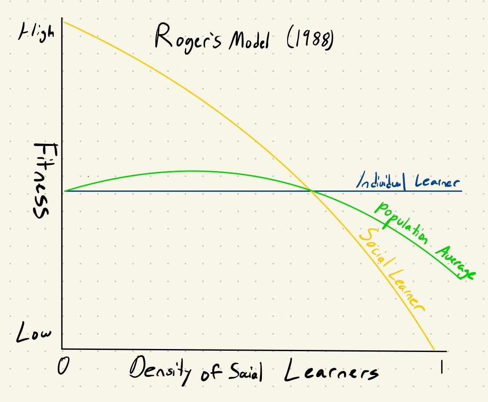

There are two types of learners: individual learners and social learners. Individual learners form their own priors and reach their own conclusions. If you asked an individual learner what the best dish at a restaurant is, they’d try every dish and let you know. Social learners on the other hand look to others to reach conclusions and would read the Yelp reviews making recommendations accordingly.

The effectiveness or fitness (in evolution terms) of these learners varies. The fitness of an individual learner is independent of what everyone else is doing. For the social learner however, the density of other social learners determines their fitness. If there are few individual learners-- and accordingly few Yelp reviews-- the social learner won’t be able to make good food recommendations. If, however, almost everyone is an individual learner-- and there are a lot of Yelp reviews-- the social learner will be quite fit.

This model comes from Alan Rogers’ seminal paper on cultural evolution [1]. While simple, I find it incredibly helpful in thinking about hype cycles and how consensus in tech can seem to go astray. The figure shown is derived from Rogers’ paper and describes the average population fitness (shown in green) depending on the density of social learners. Since the curve has a max around the middle of the x-axis, with too few or too many social learners one ends up missing the greatest potential average fitness. 

The immediate question that arises for me in the tech sector is the following: where are we situated on that green curve? Are we to the right of the curve, where the individual learner is fitter than the social learner? Or do we need more social learners? 

The recent crypto craze provides us with some insight into this question. Crypto is a great example of what can happen when there is an excess of social learning. The tech is so inaccessible that there is a barrier to individual learning. For example, when I tried building my first decentralized app (with the now deprecated [hyperedger composer](https://www.hyperledger.org/use/composer)), I found the documentation frustratingly sparse and the source code hard to work with. I ended up spending more of my time reading reports about the promise of crypto’s outlook instead of actually coding. This pattern is not uncommon: when the cost of individual learning is high, we often revert to social learning. While this fallback mechanism isn’t detrimental to fitness at the individual level if only a few resort to it, when too many fail to learn individually, population fitness deteriorates. Despite building in crypto becoming more accessible, and more usable better documented projects emerging, I’d still assert that most people involved with crypto were social learners. This led to a general bullish sentiment that led developers (the individual learners) to spend time building out infrastructure for a paradigm that is yet to materialize. They built for the nth order needs of a crypto revolution convinced it would happen. The social learning has instilled individual learners with a false confidence. Here, social learning clearly led us astray. 

With this backdrop, the recent surge of LLMs like ChatGPT makes a lot of sense. People became fatigued with tech that was far removed and hard to understand. ChatGPT offered the exact reverse: the cutting edge was made accessible to everyone. Almost anyone could be an individual learner, writing new prompts and testing novel capabilities. OpenAI introduced an alternative to the social learning disillusionment characteristic of crypto. 

ChatGPT also made teaching, a crucial aspect of social learning, much easier. A rush of AI text generations saturated twitter feeds. While it is a positive development to move away from incestuous social learning and rely on our own experimentation, our understanding of the LLM boom is still plagued by surplus social learning. 

First, people are still not doing enough individual learning. ChatGPT is enticing because of its low barrier to entry, it’s still just one of many state-of-the-art models built for different tasks. The lack of learning with those models and tunnel vision honed on ChatGPT has created distortions in the space. Specifically, 

(1)	OpenAI doesn’t have the best models for every task. I found this out empirically when building out a lecture QA search tool. Some embeddings are better for certain tasks and not all embeddings are created equal.

(2)	ChatGPT learning has overstressed the generative capabilities of LLMs. A tweet showing a cool model response might be easy to create and viral, but other applications such as search and the ability to create structured data from unstrucuted data are in my opinion just as valuable—though harder to make quick tweets about. 

I think these two examples point toward a tech space fraught with social learning. This makes sense in the market context. Tech is fueled by FOMO. No VC wants to miss the next 100x company, no founder the next tech paradigm, and no employee the next life-changing options package. So we are constantly trying to learn about the hottest innovation. But when switching focuses so frequently, individual learning is expensive as it’s more time consuming. Defaulting to social learning is quick and painless—most people prefer readings tweets over debugging poorly documented code. 

At this point, you might be objecting to such a model on account of its oversimplification. One additional layer of complexity is the addition of a third role: the critical social learner, who critically evaluates and tests different claims [2]. Their fitness increases with density, as the best ideas bubble up.

While it’s tempting to call most social learners critical social learners, I think to assume such label one must do a bit of individual learning as well. To do a good job at evaluating claims, doing your own research, playing around with tech yourself, and stress testing claims makes you a much better judge.

The other key consideration is degrees away from individual learner. Indexing on social learners many degrees of away from individual learners can lead one afoul. If you’re a student reading this, and you want to learn about LLM, why scroll your Twitter feed when chances are you can hit up a professor’s office hours or reach out to industry experts. Social learning upon social learning creates bubbles and distortions. 

With this in mind, don’t forgo individual learning. Add value to your ecosystem and community. Do the work to have your own opinion; leave your own Yelp food review. Conversely, be aware of the communities you are in. Are they comprised of social or individual learners? Often, I find that these sorts of people end up congregating around each other. While ultimately, as Rogers points out, you want both, a course correction is due. Tech is listing, don’t let it capsize again. ∎

 [1] https://www.jstor.org/stable/680759 \
 [2] https://www.jstor.org/stable/27563823
